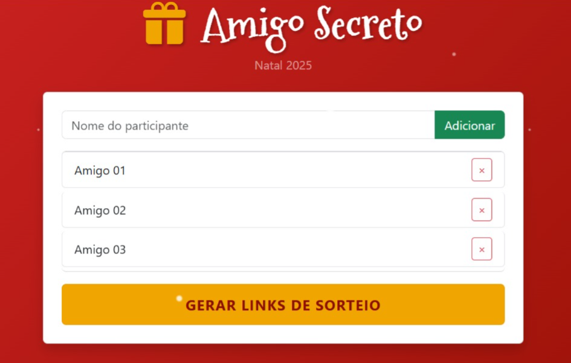
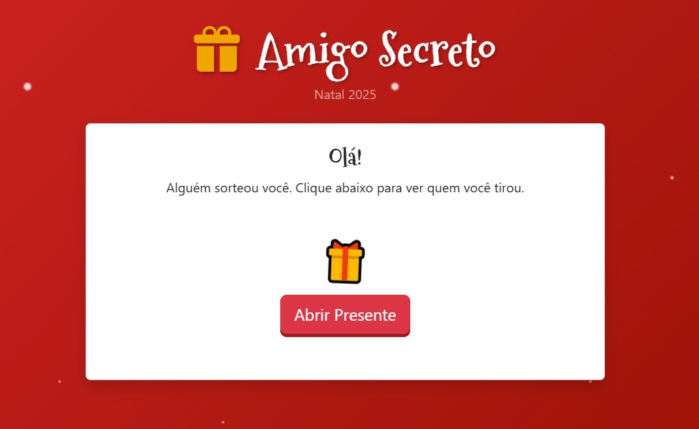

# 🎅 LinkSecreto - Amigo Secreto Remoto

Uma aplicação web para realizar sorteios de Amigo Secreto de forma remota, sem cadastro e sem banco de dados. O projeto gera links únicos e criptografados que podem ser enviados via WhatsApp, garantindo que apenas a pessoa certa veja quem tirou.


> **[Clique aqui para ver o Projeto Online](https://emillyandradedev.github.io/amigo-secreto-js/)**

---

## 📸 Screenshots

| Tela de Sorteio (Admin) | Tela de Revelação (Usuário) |
|:---:|:---:|
|  |  |

---

## 🚀 Funcionalidades

* **Cadastro Ágil:** Adicione participantes pressionando Enter ou clicando no botão.

* **Sorteio Inteligente:** Algoritmo que impede que uma pessoa tire a si mesma.

* Sem Servidor **(Client-Side):** Toda a lógica acontece no navegador. O "segredo" é passado via URL.

* **Persistência de Dados:** Uso de ```localStorage``` para salvar/carregar a lista automaticamente, garantindo que os dados permaneçam salvos entre sessões sem necessidade de banco de dados.

* **Compartilhamento Fácil:**

    * Botão direto para **WhatsApp com mensagem pré-configurada**.

    * Botão de **Copiar Link com feedback visual** e API de Clipboard.

* **Modo Revelação:** Ao acessar o link gerado, a interface muda automaticamente para exibir o resultado.

* **Interface Temática:** Design responsivo com tema de Natal, animações CSS e efeito de neve.

### 🛠️ Tecnologias Utilizadas

    

---

## 🧠 Como Funciona (Lógica do Projeto)

* O diferencial deste projeto é não depender de um banco de dados para armazenar quem tirou quem. A persistência do dado é feita na própria URL.

* Sorteio: O algoritmo Fisher-Yates Shuffle embaralha a lista de participantes.

* Codificação: O nome do amigo secreto é codificado em Base64 usando btoa() e encodeURIComponent() para garantir suporte a caracteres especiais.

* Geração do Link: O link é montado com um parâmetro ?k=ResultadOemBasE64.

* Leitura: Quando o usuário abre o link, o script detecta o parâmetro k na URL, decodifica com atob() e exibe o resultado na tela.


```bash
// Exemplo simplificado da lógica de URL
const params = new URLSearchParams(window.location.search);
const segredo = params.get('k'); // Recupera o hash
```

---

### 📂 Estrutura do Projeto

```
/amigo-secreto-js
├── assets/
│   └── img
├── css/
│   └── style.css   
├── js/
│   └── app.js
├── index.html 
└── README.md
```
---

### 🔧 Como rodar localmente

1. Clone este repositório:
```bash
git clone https://github.com/EmillyAndradeDev/amigo-secreto-js.git
```
2. Abra o arquivo ```index.html``` no seu navegador.

---

### 🌟 Melhorias Futuras (Roadmap)

* [ ] Criar opção de "Restrições" (ex: Casais não podem se tirar).

* [ ] Permitir adicionar lista de desejos junto com o nome.